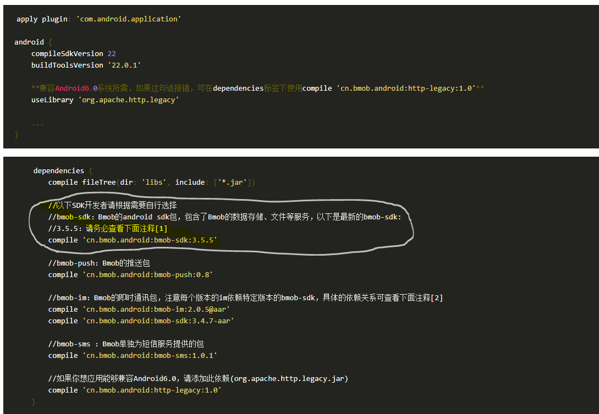
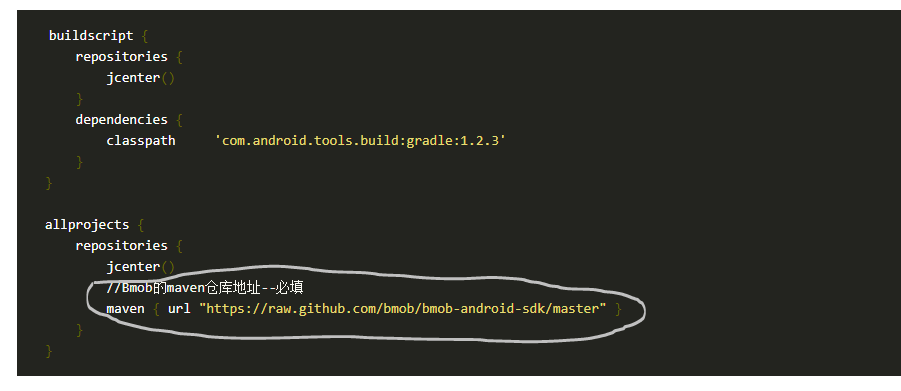

# Bmob装载教程

## 第一步：  
首先需要有一个账号，按照网上教程进行注册，网址如下：  
- [Bmob官方链接](https://docs.bmob.cn/data/Android/a_faststart/doc/index.html)
## 第二步：  
在app的build.gradle文件中添加compile依赖文件,示例如下：（注意文字说明部分）：  

## 第三步：
在 Project 的 build.gradle 文件中添加 Bmob的maven仓库地址，示例如下：（注意文字说明部分）：  

注意：  
**只需要加白线圈里的内容**
